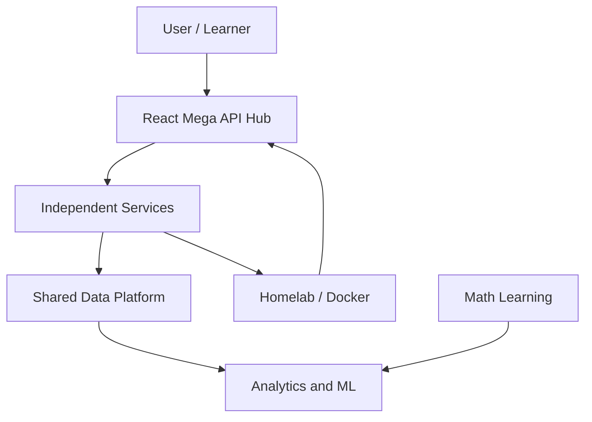
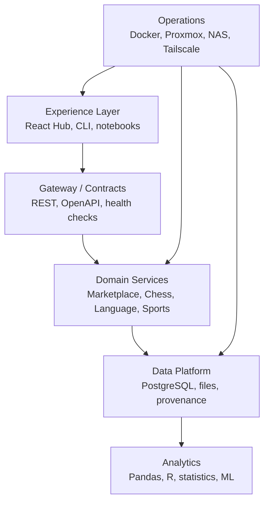
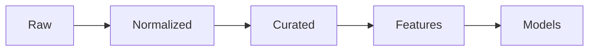

# Ideas Ecosystem — Master Agent Handoff

> **Document type:** Living project handoff / durable context file  
> **Primary owner:** User  
> **Audience:** ChatGPT, Codex, Cursor agents, Claude, GitHub Copilot, and any other AI or human collaborator  
> **Created:** 2026-09-02  
> **Last updated:** 2026-09-02  
> **Status:** Active, foundational draft; learning workflow expanded  
> **Scope:** The user's interconnected programming, data, AI, math, marketplace, API, Web3, language-learning, retro-game, and homelab project ecosystem

---

## 0. Read This First

This file exists because conversation history is fragmented across ChatGPT chats, Cursor sessions, GitHub repositories, local machines, and homelab systems. It is intended to prevent future agents from restarting the user's work, losing settled decisions, or treating connected projects as unrelated tutorials.

An agent beginning work should:

1. Read this entire file before proposing architecture or making project-wide changes.
2. Inspect the current repository, branch, `git status`, README, issue tracker, and any project-specific handoff before editing code.
3. Treat the **latest repository state and latest dated handoff entry** as more authoritative than an older summary here.
4. Distinguish clearly between:
   - **Confirmed:** explicitly chosen or already implemented.
   - **Planned:** intended direction but not yet implemented.
   - **Proposed:** brainstormed option that still needs evaluation.
   - **Unknown:** must be inspected or decided; never silently assume.
5. Continue from the current level. Do not restart a tutorial or rebuild a repository simply because an earlier step is unfamiliar.
6. Teach while building. The user wants to understand the commands, syntax, architecture, data flow, and tradeoffs—not merely receive generated code.
7. Update this handoff after material decisions, milestones, blockers, environment changes, or architecture changes.

### Source-of-truth order

When sources conflict, use this priority:

1. The user's newest explicit instruction.
2. Current code, configuration, and Git history in the relevant repository.
3. The newest dated project-specific handoff or decision record.
4. This master handoff.
5. Older chat summaries or brainstorms.

### Safety and privacy

- Never place passwords, API keys, service credentials, tokens, private keys, recovery codes, or cookies in this file or Git.
- Use `.env` files locally and commit only `.env.example` with placeholders.
- Do not expose homelab services publicly without explaining authentication, TLS, firewall, update, backup, and threat-model implications.
- Treat marketplace collection, scraping, archival, ROM, media, and AI-training ideas as subject to terms of service, copyright, privacy, robots rules, rate limits, and applicable law.
- Prefer official APIs, user exports, licensed datasets, manual observations, and public data. Do not recommend bypassing access controls or anti-bot protections.

### Handoff file set

This master file contains the complete ecosystem context. Agents doing focused work should use the smaller files to reduce context loss:

1. Read [`AGENT_INSTRUCTIONS.md`](AGENT_INSTRUCTIONS.md) for the reusable teaching, command-line, debugging, architecture, software-exposure, safety, and session rules.
2. Read this master file when cross-project history or strategy matters.
3. Read the relevant project handoff:

| Project | Focused handoff |
| --- | --- |
| React Mega API Hub | [`PROJECT_REACT_MEGA_API_HUB.md`](project-handoffs/PROJECT_REACT_MEGA_API_HUB.md) |
| Marketplace Intelligence | [`PROJECT_MARKETPLACE_INTELLIGENCE.md`](project-handoffs/PROJECT_MARKETPLACE_INTELLIGENCE.md) |
| Math Lab (`mathy`) | [`PROJECT_MATHY.md`](project-handoffs/PROJECT_MATHY.md) |
| Go Language Lab | [`PROJECT_LANGUAGE_LAB.md`](project-handoffs/PROJECT_LANGUAGE_LAB.md) |
| Blockchain/Web3 | [`PROJECT_BLOCKCHAIN_WEB3.md`](project-handoffs/PROJECT_BLOCKCHAIN_WEB3.md) |
| Retro Game Preservation | [`PROJECT_RETRO_GAME_PRESERVATION.md`](project-handoffs/PROJECT_RETRO_GAME_PRESERVATION.md) |
| Chess Analytics | [`PROJECT_CHESS_ANALYTICS.md`](project-handoffs/PROJECT_CHESS_ANALYTICS.md) |
| Sports Data | [`PROJECT_SPORTS_DATA.md`](project-handoffs/PROJECT_SPORTS_DATA.md) |
| Science/Space/Nature | [`PROJECT_SCIENCE_SPACE_NATURE.md`](project-handoffs/PROJECT_SCIENCE_SPACE_NATURE.md) |
| History/Archives/Media | [`PROJECT_HISTORY_ARCHIVES_MEDIA.md`](project-handoffs/PROJECT_HISTORY_ARCHIVES_MEDIA.md) |
| Reference Collector | [`PROJECT_REFERENCE_COLLECTOR.md`](project-handoffs/PROJECT_REFERENCE_COLLECTOR.md) |
| Homelab/DevOps | [`PROJECT_HOMELAB_DEVOPS.md`](project-handoffs/PROJECT_HOMELAB_DEVOPS.md) |
| Cybersecurity/Kali | [`PROJECT_CYBERSECURITY_KALI.md`](project-handoffs/PROJECT_CYBERSECURITY_KALI.md) |
| Shared Data/AI Platform | [`PROJECT_SHARED_DATA_AI_PLATFORM.md`](project-handoffs/PROJECT_SHARED_DATA_AI_PLATFORM.md) |

The focused handoffs are working summaries, while this master remains the broadest source of ecosystem context. Update both the relevant focused file and this master when a decision affects multiple projects.

---

## 1. Executive Summary

The user is not trying to accumulate disconnected beginner tutorials. The long-term goal is to build an **interconnected learning laboratory** in which real projects teach programming, APIs, databases, data engineering, mathematics, AI/ML, infrastructure, cybersecurity, and professional software-development practices.

The four major pillars currently are:

1. **Mega API Hub** — a React/TypeScript front end that discovers and communicates with independent services written in Python, Rust, Go, Java, and other languages.
2. **Marketplace and Collectibles Intelligence** — collect and normalize market data, initially emphasizing lower-cost cards, then analyze prices, liquidity, trends, risk, and opportunities.
3. **Math → Data Science → AI/ML (`mathy`)** — rebuild mathematics from Algebra 1 upward and convert each concept into code, visualizations, statistics, and eventually machine-learning applications.
4. **Homelab / DevOps Platform** — Proxmox, Debian, Docker, Synology NAS, Tailscale, monitoring, databases, APIs, and deployment environments supporting the other projects.

Other major branches—including Language Lab, Blockchain/Web3, Chess Analytics, Sports Data, Science/Space/Geography/Nature, History/Archives/Media, Reference Collector, and Retro Game Preservation—should be independently useful while also being capable of integrating into the Mega API Hub.

The recurring architecture pattern is:



The user wants this ecosystem to remain broad enough for experimentation but organized enough to become a serious portfolio, learning environment, and possible business foundation.

**Default collaboration model:** These are learning projects. The user should normally type the commands and write the code, while the agent teaches, explains, checks, debugs, and progressively introduces architecture and professional software. An agent should only take over implementation when the user explicitly asks it to do so.

---

## 2. User Profile Relevant to the Work

### 2.1 Background and goals

- The user works as a **Respiratory Therapist in a hospital** and is interested in expanding clinical knowledge.
- The user is a hands-on, curiosity-driven learner with interests spanning programming, databases, AI, game development, 2D/3D art, cybersecurity, electronics, music, science, sports, history, collectibles, and infrastructure.
- The user benefits from explanations that connect an abstract concept to a concrete system or dataset.
- The user wants to progress toward AI and machine learning with the mathematical depth required to understand—not merely call—models.
- The user wants multiple languages and professional tools represented across the ecosystem instead of using Python for everything.
- The user uses AI agents heavily and wants explicit handoff files because chat context is not reliably shared between agents.

### 2.2 Teaching preferences

Agents should:

- Explain **what a command does, why it is used, what each important flag means, and what output to expect**.
- Present small, verifiable steps when the user is executing commands manually.
- Ask the user to paste command output before advancing when state matters.
- Explain syntax and architecture rather than hiding everything behind generated files.
- Avoid revealing the solution immediately for learning exercises unless the user asks for it.
- Use mistakes as diagnostic signals: explain what misconception or missing concept produced the error.
- Introduce tools gradually, but do not avoid professional tools just because the user is learning.
- Show how concepts connect across languages, operating systems, databases, mathematics, and infrastructure.
- Preserve experiments and learning artifacts when they have instructional value.
- Suggest meaningful Git commits at natural milestones.
- Avoid restarting from basic setup if it is already complete.

### 2.3 Preferred learning loop

The established math workflow generalizes well to other subjects:

> **Understand → solve manually → experiment → visualize → verify → code → record**

For software projects, a parallel loop is:

> **Define behavior → inspect current state → implement a small slice → test → observe → explain → document → commit**

### 2.4 Breadth is intentional

The user frequently asks to include more languages, IDEs, extensions, APIs, infrastructure, and adjacent tools. This is intentional because the ecosystem is also a learning laboratory. However, agents must manage that breadth through staged adoption:

- Use one primary tool for the current milestone.
- Explain alternatives and why they are deferred.
- Add technologies when they teach a distinct concept or solve a real problem.
- Avoid adding tools solely to inflate the stack.

### 2.5 The user writes the code

The default assumption for these projects is:

> **The agent teaches and guides; the user types the commands and writes the code.**

This is essential to the learning goal. Agents should not silently create a complete feature, paste an unexplained full application, or hide all setup behind automation when the user is trying to learn the underlying work.

Instead, the agent should:

1. Explain the immediate goal.
2. Show the specific command or small code section for the user to enter.
3. Explain the syntax, important symbols, arguments, and structure.
4. State where the code belongs and why.
5. Explain what output or behavior to expect.
6. Ask the user to run it and share the result when verification matters.
7. Diagnose the actual result before continuing.
8. Connect the small step to the larger architecture.

This default can be overridden by a direct request such as “implement this for me,” “edit the files,” or “build the feature.” Even then, the agent should explain the major changes and verification rather than returning opaque work.

---

## 2A. Learning-by-Doing Collaboration Contract

### 2A.1 Default mode: guided implementation

Unless the user explicitly requests direct implementation, use **guided implementation mode**:

- The user creates folders and files.
- The user enters commands.
- The user types or carefully transcribes the code.
- The agent supplies one coherent step at a time.
- The agent explains what every important line does.
- The agent pauses at meaningful verification points.
- The agent adapts the next step to the user's output.

Do not confuse “the user types the code” with withholding help. Give exact commands and code, but keep each unit small enough that the user can understand what is being introduced.

### 2A.2 Available collaboration modes

| Mode | When to use | Agent behavior | User behavior |
| --- | --- | --- | --- |
| Guided implementation | Default for learning work | Teach, provide small steps, explain, inspect output | Type commands and code |
| Pair programming | User wants faster back-and-forth | Propose a small change, review user code, debug together | Writes most code and discusses choices |
| Exercise mode | Practicing a known concept | Give requirements, hints, tests, and feedback before answers | Attempts solution independently |
| Demonstration mode | A concept needs a compact example | Show a minimal example, then dissect it | Runs/modifies example |
| Direct implementation | Only when explicitly requested | Edit/build/test the requested work, then explain | Reviews and asks questions |
| Review/diagnosis | User asks what is wrong or how code works | Inspect and explain; do not rewrite everything automatically | Provides code/output and decides next change |

If the desired mode is unclear, preserve momentum with guided implementation rather than asking a broad process question.

### 2A.3 Step size and pacing

A good learning step usually introduces one primary idea:

- one command;
- one file;
- one function;
- one route;
- one database table;
- one test;
- one debugging hypothesis;
- one Git action.

Several tightly related lines may be taught together. Avoid overwhelming the user with a 300-line solution that contains ten new ideas. Large files should be divided into logical sections, each explained and verified.

At each checkpoint, agents should include:

- **Action:** what the user should type or change
- **Location:** terminal/directory/file and insertion point
- **Explanation:** syntax and purpose
- **Expected result:** output, file tree, UI behavior, or test result
- **If it differs:** what output the user should paste back

### 2A.4 Syntax explanation standard

When introducing new code, explain:

- keywords;
- functions and methods;
- variables and types;
- punctuation with structural meaning;
- operators;
- imports/packages;
- parameters and return values;
- control flow;
- data structures;
- error handling;
- how the runtime executes the code;
- conventions versus language requirements.

Example: do not merely give `mkdir marketplace-service`. Explain that `mkdir` means **make directory**, that `marketplace-service` is the new directory name, that the command acts relative to the current working directory unless an absolute path is used, and how to verify the result.

When syntax resembles another language the user knows, compare them. Examples:

- Go `if err != nil` versus Python exceptions
- Rust `Result` versus Go's explicit error return
- TypeScript interfaces versus Python type hints
- Bash pipelines versus PowerShell object pipelines
- SQL joins versus merging Pandas DataFrames

### 2A.5 Explain usage, not only syntax

For every important tool or construct, also explain:

- when it is appropriate;
- when it is unnecessary;
- common mistakes;
- performance or security implications;
- how it appears in professional projects;
- alternatives and why the current choice was selected.

For example, teaching a PostgreSQL index should include what lookup it helps, its write/storage cost, how to inspect the query plan, and why every column should not automatically be indexed.

### 2A.6 Verification is part of learning

Do not treat successful code entry as proof that the concept works. Teach verification:

- inspect the file tree;
- read command output;
- run the program;
- call the API;
- query the database;
- run the test;
- inspect logs;
- use browser developer tools;
- confirm Git changes;
- deliberately try one invalid input;
- compare actual and expected behavior.

Agents should explain what a successful result means and what it does **not** prove.

---

## 2B. Command-Line Learning Requirements

### 2B.1 Use the command line whenever it adds real learning value

The user wants command-line knowledge to grow alongside programming. Do not avoid the terminal by always telling the user to click through a GUI. When safe and relevant, teach the command-line operation even if a GUI alternative exists.

Examples include:

- identifying the current directory;
- listing files, including useful metadata;
- creating folders and files;
- moving and copying files;
- searching filenames and file contents;
- inspecting processes and ports;
- managing packages;
- running formatters, linters, tests, and builds;
- working with Git;
- starting and inspecting Docker services;
- sending HTTP requests;
- connecting to and querying databases;
- reading logs;
- inspecting environment variables safely;

### 2B.2 Explain command anatomy

For each unfamiliar command, explain:

```text
command  subcommand  options/flags  arguments  redirection/pipeline
```

Also explain:

- current working directory;
- relative versus absolute paths;
- quoting paths that contain spaces;
- short versus long flags;
- exit codes;
- standard output versus standard error;
- pipes and redirection;
- shell expansion;
- why copying commands blindly can be dangerous.

### 2B.3 Basic filesystem commands to teach naturally

Do not teach these as an isolated memorization dump. Introduce them when the project needs them.

| Purpose | Bash/Linux/macOS | PowerShell | Teaching note |
| --- | --- | --- | --- |
| Show current directory | `pwd` | `Get-Location` (`pwd` alias) | Establish where the next command acts |
| List directory | `ls -la` | `Get-ChildItem` (`ls` alias) | Explain hidden files and metadata |
| Create directory | `mkdir marketplace-service` | `New-Item -ItemType Directory marketplace-service` | Explain relative path and naming |
| Enter directory | `cd marketplace-service` | `Set-Location marketplace-service` (`cd`) | Explain that the shell's working directory changes |
| Create empty file | `touch README.md` | `New-Item -ItemType File README.md` | Prefer editor creation when content is immediately needed |
| Copy file | `cp source target` | `Copy-Item source target` | Explain source and destination order |
| Move/rename | `mv old new` | `Move-Item old new` | Same mechanism often handles move and rename |
| Remove file | `rm file` | `Remove-Item file` | Pause and verify target; deletion can be destructive |
| Create nested folders | `mkdir -p src/tests` | `New-Item -ItemType Directory -Force src/tests` | Explain parent creation and `-Force` behavior |
| Show file content | `less file`, `head`, `tail` | `Get-Content file` | Select command based on file size/use |
| Search text | `rg 'pattern'` | `rg 'pattern'` if installed | Prefer ripgrep for code searches |
| Find files | `find`, `fd` | `Get-ChildItem -Recurse` or `fd` | Explain filename versus content search |

Never use a destructive command merely for demonstration. Before `rm`, recursive deletion, overwriting, database drops, container-volume deletion, or force operations, resolve and restate the exact target.

### 2B.4 Teach shell differences

The user works with both Windows and Linux. Explain when a command is:

- Bash-specific;
- PowerShell-specific;
- an alias that means something different across shells;
- a native executable available in both environments;
- being run locally versus over SSH;
- being run on Windows, a Debian VM/LXC, the Proxmox host, or inside a container.

PowerShell pipelines pass objects, whereas traditional Unix pipelines primarily pass text. This difference should be taught through real examples rather than reduced to command-equivalence lists.

### 2B.5 Terminal location labels

Before giving a command, identify where it should run when ambiguity is possible:

- **Windows PowerShell on development PC**
- **Linux shell on `docker-server` over SSH**
- **Debian test LXC**
- **Proxmox host shell**
- **inside a Docker container**
- **PostgreSQL `psql` prompt**
- **project directory and branch**

This prevents commands intended for a safe test system from being run on critical infrastructure.

---

## 2C. Architecture Teaching Requirements

Architecture knowledge should be introduced when a project decision or debugging problem makes it relevant. Do not reduce architecture to unexplained diagrams or postpone it until the system is large.

### 2C.1 Topics to teach progressively

- client versus server
- front end versus backend
- process, service, container, VM, and physical host
- request/response lifecycle
- routes, controllers/handlers, services, repositories, and database layers
- dependency direction
- interfaces and adapters
- monolith, modular monolith, and microservices
- synchronous versus asynchronous work
- queues and background jobs
- stateful versus stateless services
- database ownership
- caching
- authentication versus authorization
- network ports, DNS, TLS, proxies, and firewalls
- deployment environments
- scaling, reliability, backups, and observability
- data pipelines and model-serving architecture

### 2C.2 Always connect diagrams to code and runtime behavior

When explaining architecture, trace a concrete action end-to-end. Example:

> User clicks **Search card** in React → the browser sends HTTP JSON to FastAPI → the route validates the query → a service applies domain logic → a repository queries PostgreSQL → results are serialized to JSON → React renders them.

Then identify which file/function represents each stage. Explain which parts run in the browser, development PC, VM, container, database, or third-party provider.

### 2C.3 Explain tradeoffs

Architecture teaching should include why a choice was made and what it costs. For example:

- independent services teach language boundaries but add networking and operational complexity;
- PostgreSQL provides strong relational features but requires administration compared with SQLite;
- Docker improves repeatability but adds volumes, networks, images, and lifecycle concepts;
- caching improves latency but introduces invalidation and stale data;
- background jobs improve responsiveness but create eventual consistency and retry concerns.

### 2C.4 Avoid architecture theater

Do not introduce microservices, Kubernetes, Kafka, service meshes, event sourcing, or elaborate cloud infrastructure just because they are professional technologies. Introduce them through a lab or real requirement that exposes their benefits and costs.

---

## 2D. Debugging Must Be Taught Explicitly

Debugging is a primary learning objective, not an interruption to coding.

### 2D.1 Standard debugging loop

Agents should teach and model this sequence:

1. **Reproduce:** state the exact action that triggers the problem.
2. **Observe:** capture the complete error, logs, inputs, environment, and relevant state.
3. **Localize:** identify which layer likely failed.
4. **Hypothesize:** propose one or a few testable causes.
5. **Test narrowly:** use the smallest safe command, log, breakpoint, or isolated case.
6. **Fix the cause:** avoid hiding the symptom.
7. **Verify:** rerun the original failure path and nearby edge cases.
8. **Prevent regression:** add a test, validation, health check, or documentation.
9. **Record:** update the handoff when the failure teaches something durable about the environment.

### 2D.2 Explain errors line by line

When the user provides an error:

- preserve the exact message;
- identify the program that emitted it;
- explain the relevant filename, line number, error type/code, and stack frames;
- separate the root cause from secondary cascading errors;
- explain why the proposed diagnostic command can confirm or reject the hypothesis;
- do not jump immediately to reinstalling everything.

### 2D.3 Debug across layers

Teach the appropriate tools for the layer:

| Layer | Examples of tools/techniques |
| --- | --- |
| Browser/UI | DevTools Elements, Console, Network, React DevTools |
| TypeScript/Node | stack traces, source maps, debugger, tests, type checker |
| Python | tracebacks, `breakpoint()`, logging, pytest, Ruff/type checking |
| Go | returned errors, `slog`, Delve, `go test`, race detector |
| Rust | compiler diagnostics, `dbg!`, `RUST_BACKTRACE`, tests, Clippy |
| API | `curl`, HTTPie, Bruno/Postman/Insomnia, OpenAPI docs |
| Database | `psql`, SQL clients, constraints, transactions, `EXPLAIN ANALYZE` |
| Docker | `docker ps`, `docker logs`, `docker inspect`, Compose status |
| Linux | `journalctl`, `systemctl`, `ss`, `ps`, `top`/`htop`, permissions |
| Network | `ping` where useful, `curl`, `dig`, `traceroute`, `tcpdump`, Wireshark |
| Git | `status`, `diff`, `log`, `show`, branch comparison |

Only introduce commands needed for the current diagnosis, then explain how they generalize.

### 2D.4 Encourage prediction

Before running a debugging command, ask or explain:

- What do we expect to see if the hypothesis is correct?
- What result would disprove it?
- Which layer do we inspect next in either case?

This builds diagnostic reasoning rather than a habit of copying random fixes.

---

## 2E. Expanding Software Knowledge

The user wants broad exposure to professional, useful, and interesting software. Agents should deliberately introduce tools throughout the projects, while keeping one primary tool per immediate job.

### 2E.1 Software-introduction rule

Whenever a new category becomes relevant:

1. Name the primary tool being used now.
2. Explain what problem category it solves.
3. Mention two or three meaningful alternatives.
4. Compare the main tradeoffs briefly.
5. Teach the selected tool through the current project.
6. Record a future mini-lab if an alternative would teach a genuinely different workflow.

Do not install ten overlapping programs at once. Breadth should accumulate over time through real use.

### 2E.2 Software categories to incorporate progressively

| Category | Primary/current candidates | Alternatives or later exposure | Learning purpose |
| --- | --- | --- | --- |
| Editors/IDEs | Cursor, VS Code, Visual Studio, PyCharm | IntelliJ IDEA, WebStorm, GoLand, RustRover, DataGrip, Zed | editor workflows, debugging, refactoring, language tooling |
| Source control | Git, GitHub | GitLab, Forgejo/Gitea in homelab | branches, reviews, issues, CI, self-hosting |
| API clients | browser/OpenAPI UI, `curl` | HTTPie, Bruno, Postman, Insomnia | inspect requests, headers, payloads, authentication |
| API design | FastAPI/OpenAPI | Swagger Editor, Stoplight, Redoc, Spectral | contracts, validation, documentation |
| Relational databases | PostgreSQL | SQLite, MySQL/MariaDB, SQL Server | schema design, transactions, dialect differences |
| Database GUIs | pgAdmin or DBeaver | DataGrip, Beekeeper Studio, SSMS, Azure Data Studio alternatives | query, inspect schemas, plans, administration |
| Data transformation | Python/Pandas, SQL | Polars, DuckDB, dbt, R/tidyverse | cleaning, analytical queries, reproducible transformations |
| Notebooks | JupyterLab | VS Code notebooks, Quarto, Observable | experiments, explanations, reproducible analysis |
| Visualization/BI | Matplotlib | Seaborn, Plotly, Altair, Power BI, Tableau Public, Grafana | charts, dashboards, monitoring, storytelling |
| Containers | Docker, Compose | Podman, containerd concepts | reproducibility, isolation, deployment |
| Virtualization | Proxmox | Hyper-V, VirtualBox, VMware concepts | VMs, LXCs, snapshots, networking |
| CI/CD | GitHub Actions | GitLab CI, Jenkins, Woodpecker | automated quality checks and delivery |
| Task/build runners | npm scripts, language-native commands | Make, Just, Taskfile | repeatable developer commands |
| Testing | pytest, Vitest, Go test, Cargo test | Playwright, Cypress, k6, Postman/Bruno tests | correctness from units to end-to-end/load |
| Code quality | Ruff, Prettier, ESLint, Clippy | Biome, Black, mypy/pyright, golangci-lint | formatting, linting, types, consistency |
| Observability | logs, Dozzle, Uptime Kuma | Prometheus, Grafana, Loki, OpenTelemetry, Sentry | health, metrics, traces, alerting |
| Networking | Tailscale, Nginx Proxy Manager | Caddy, Traefik, Cloudflare Tunnel concepts | DNS, routing, proxies, TLS, secure remote access |
| Secrets/config | `.env` locally | SOPS, age, Vault, Docker secrets, GitHub secrets | configuration and secret lifecycle |
| Documentation | Markdown, Mermaid | MkDocs, Docusaurus, Sphinx, Quarto | durable knowledge and generated docs |
| Architecture modeling | Mermaid | draw.io/diagrams.net, Excalidraw, PlantUML | visualize systems and data flow |
| Project management | Markdown/GitHub Issues | GitHub Projects, Trello, Linear, Jira, Obsidian | backlog, milestones, decision tracking |
| Data/versioning | Git for code | DVC, lakeFS concepts, object storage | datasets, lineage, reproducibility |
| Messaging/jobs | simple in-process jobs first | Redis, Celery/RQ, RabbitMQ, NATS, Kafka concepts | background work and event-driven design |
| Search | PostgreSQL search first | Meilisearch, Typesense, Elasticsearch/OpenSearch | indexing and retrieval |
| Local AI | Python/RTX 3090 experiments | Ollama, llama.cpp, vLLM, MLflow | inference, serving, experiment tracking |
| Security | dependency updates and basic scanning | Trivy, Semgrep, CodeQL, OWASP ZAP | supply chain, static analysis, web testing |
| 2D/3D/game tools | Godot, Unity, Blender, Krita | Unreal, Aseprite, Blockbench, Bforartists, UPBGE | creative pipelines and engine/tool comparisons |

This is an exposure catalog, not a requirement to adopt every item.

### 2E.3 Learn software through comparison labs

When appropriate, create small comparison exercises rather than migrating a real project unnecessarily. Examples:

- query the same dataset in PostgreSQL, DuckDB, Pandas, and R;
- call one API with `curl`, HTTPie, Bruno, and a small Python script;
- inspect the same Git repository in Cursor and a JetBrains IDE;
- run the same container through Docker CLI and Compose;
- produce the same chart with Matplotlib and Plotly;
- compare SQLite's embedded workflow with PostgreSQL's server workflow;
- debug the same HTTP request in browser DevTools and server logs.

The goal is to understand categories and tradeoffs, not to replace working tools constantly.

---

## 3. Non-Negotiable Working Principles

### 3.1 Independent services, integrated experience

**Confirmed decision:** A Python, Rust, Go, Java, or other application must remain independently runnable and developable. Integration with the React hub happens through an API or other stable contract.

The hub is a client and orchestration surface, not a reason to collapse every project into one language or repository.

An independent service may retain its own:

- CLI or native GUI
- core/business logic
- database
- release cadence
- tests
- deployment method
- repository

To integrate it, add a thin interface—usually REST/JSON first—that reuses the existing core logic.

### 3.2 Professional workflow from the beginning

Use real engineering practices at a scale appropriate to the project:

- Git and GitHub
- clear `README.md`
- stable `main` and active `dev`
- feature branches for substantial changes
- issues or a lightweight backlog
- formatter and linter
- automated tests
- environment-based configuration
- dependency pinning / lockfiles
- API documentation
- database migrations
- structured logging
- Docker where it adds learning or deployment value
- CI/CD introduced progressively
- decision records for architecture choices
- handoff updates for agents

### 3.3 Teaching and delivery must coexist

Agents should neither turn every task into a lecture nor silently build an opaque system. The desired balance is:

- lead with the current outcome;
- explain the key mechanism;
- give the next safe action;
- show relevant syntax in context;
- verify before moving on;
- document decisions that affect future work.

### 3.4 Prefer contracts over coupling

Use explicit boundaries:

- HTTP/JSON and OpenAPI for service APIs
- schemas for data exchange
- migrations for databases
- environment variables for deployment-specific values
- adapter/provider interfaces for external marketplaces and APIs
- versioned endpoints or schemas when compatibility becomes important

### 3.5 Keep raw evidence

For data projects, preserve the distinction between:

- raw source data;
- normalized/cleaned records;
- derived features;
- model outputs;
- user corrections;
- provenance and collection time.

Do not overwrite raw data with cleaned data. Reproducibility matters.

---

## 4. Ecosystem Project Registry

| Project / domain | Status | Primary purpose | Likely main stack | Hub relationship |
| --- | --- | --- | --- | --- |
| React Mega API Hub (`reactPrac`) | Confirmed, existing repo | Learn React deeply and provide a common UI for services | React, TypeScript, Vite | Central front end |
| Marketplace Intelligence | Confirmed direction, early planning | Collectibles valuation, trend, liquidity, and decision support | Python, Pandas, FastAPI, PostgreSQL | Independent service + dashboard module |
| Math Lab (`mathy`) | Confirmed, active repo | Algebra through calculus/linear algebra/statistics and AI math | Python, SymPy, NumPy, Matplotlib, Jupyter | Supplies skills/models to other domains |
| Language Lab | Confirmed direction | Grammar, writing, vocabulary, proficiency, NLP | Go backend, React/TS, PostgreSQL | Independent Go service + module |
| Blockchain/Web3 Lab | Confirmed direction, brainstorming | Learn ledgers, contracts, wallets, NFTs, DeFi, logistics | Language depends on subproject; Solidity likely later | Services and data modules |
| Retro Game Preservation Lab | Confirmed idea, research stage | Learn emulation, archival metadata, browser delivery, preservation | Web tech, emulation runtimes, storage | Catalog/player module where lawful |
| Chess Analytics | Confirmed idea; React chess repo exists | Personal game analysis, openings, trends, statistics, engine integration | React/TS plus data/backend service | Chess module |
| Sports Data Ecosystem | Confirmed idea | NBA, NFL, NHL, UFC, WWE, F1, Olympics, and more | Per-service language; common schemas | Multiple modules/services |
| Science / Space / Nature Data | Confirmed idea | Weather, NASA, SpaceX, geospatial, animals/wildlife | Per-service language | Multiple modules/services |
| History / Archives / Media | Confirmed idea | History, antiques, film, TV, music, inventions, patents | Search/data services | Enrichment for hub and marketplace |
| Reference Collector | Existing Python project | Collect and process reference assets/information | Python, httpx, Pillow, Typer, Rich | Possible ingestion utility/service |
| Homelab / DevOps Lab | Existing and active | Host, secure, monitor, and learn infrastructure | Proxmox, Debian, Docker, Tailscale, Synology | Deployment foundation |
| Cybersecurity / Kali Lab | Existing learning environment | Learn tools safely in authorized lab systems | Kali, Wireshark, Linux tooling | Security testing/observability support |

This registry should be updated whenever a project moves from proposed to active, receives a repository, changes stack, or reaches a milestone.

---

## 5. Architectural Vision

### 5.1 Conceptual layers



### 5.2 Service contract baseline

REST should be learned first because it is broadly useful and easy to inspect. A typical service should eventually expose:

- `GET /health` — process and dependency health
- `GET /version` — service/build version
- domain resource endpoints, such as `/items`, `/listings`, `/games`, or `/analyses`
- input validation
- structured error responses
- generated OpenAPI documentation
- CORS configured only for intended front ends
- environment-based host/port/database configuration
- timeouts, retries, and rate-limit handling for external providers

Later communication styles can be introduced for a specific reason:

- Webhooks for external events
- WebSockets or server-sent events for live updates
- JSON-RPC for method-oriented systems
- queues for background ingestion and model jobs
- gRPC for strongly typed internal communication when complexity justifies it

### 5.3 Hub behavior when services are independent

The hub should not assume every service is always running. Planned behavior:

- maintain a registry of configured services;
- check service health;
- show online, degraded, or offline status;
- use environment-configured URLs;
- give helpful error states rather than blank pages;
- keep domain modules lazy-loaded where practical;
- type API responses;
- eventually generate clients from OpenAPI or share schemas.

### 5.4 Monorepo versus multirepo

**Current preference:** independent apps can remain separate repositories. The React hub acts as the integration point.

Do not prematurely force a monorepo. A future umbrella repository may contain:

- architecture documents;
- Docker Compose files for local integration;
- API contract references;
- service catalog;
- shared schemas;
- development scripts;
- this master handoff.

That umbrella should not erase the independent identity of each service.

---

## 6. Project Detail: React Mega API Hub

### 6.1 Confirmed information

- Repository: `https://github.com/Ash31393/reactPrac`
- Existing goal: learn React more deeply.
- Known base: TypeScript / React / Vite.
- New architectural role: evolve into an API Explorer and control center for independent services.
- It should communicate with external apps through their exposed HTTP/JSON APIs.

### 6.2 Learning goals

Use the hub to learn React progressively:

1. Components, props, state, events, and forms
2. TypeScript models and safe data handling
3. Fetching APIs and handling loading/error/empty states
4. Routing and domain modules
5. Reusable UI patterns
6. Custom hooks
7. Server-state caching
8. Testing
9. Accessibility
10. Performance, code splitting, and profiling
11. Authentication and authorization when needed
12. Observability and error reporting

### 6.3 Candidate modules

- Service dashboard / health monitor
- Weather
- NASA / SpaceX
- Chess
- Marketplace / collectibles
- Sports
- Language Lab
- Math visualizations
- Blockchain explorer / learning sandbox
- Geography / maps
- Wildlife / animals
- History / archives
- Film / TV / music
- Gaming and retro-game catalog
- Cars, racing, machines, and engines
- Inventions and patents
- Government/open datasets
- Medical/public-health datasets where access and privacy permit

### 6.4 Proposed technical growth

- Routing: React Router or a framework decision later
- Data fetching: begin with `fetch`; evaluate TanStack Query after core behavior is understood
- Validation: Zod or equivalent for runtime schema validation
- Testing: Vitest + React Testing Library; end-to-end testing later
- Styling: inspect current repository before deciding
- Documentation: module-level README and service contract links
- Environment variables: Vite-prefixed service URLs
- CI: lint, type-check, test, build

### 6.5 Do not do

- Do not move all backend logic into React.
- Do not make React depend on a service's internal files or database tables.
- Do not hard-code private LAN IPs in committed UI source.
- Do not replace existing project structure without inspecting it.

---

## 7. Project Detail: Marketplace and Collectibles Intelligence

### 7.1 Product idea

Build a data-driven system for researching physical items as inventory, collectibles, or investments. The initial advantage is not simply buying and reselling; it is accumulating a clean, historical, provenance-aware dataset that becomes more useful over time.

Initial focus should be lower-cost cards because entry cost and experimentation risk are lower. Candidate categories include:

- Pokémon
- Yu-Gi-Oh!
- Dragon Ball / DBZ
- Formula 1 cards
- wrestling cards
- sports cards broadly
- sneakers
- retro games and hardware
- other collectibles later

### 7.2 Marketplace/data-source landscape

Sources discussed or relevant to evaluate:

- eBay — primary early candidate because official APIs and sold-market data may be available subject to program rules
- Whatnot — key source of interest; use official access, exports, seller tools, or manual observations unless an authorized API is available
- Amazon — evaluate Product Advertising API, seller APIs, fees, category restrictions, and data-license limitations
- Facebook Marketplace — limited official data access; avoid unauthorized automated scraping
- PSA — grading/certification and population information where available
- PriceCharting — retro games and some collectibles; inspect licensing/API terms
- StockX — sneakers and market-style data where official access is available
- TCGplayer — cards; evaluate developer/API access and current terms
- COMC, Cardmarket, PWCC/Fanatics Collect, Heritage, Goldin, Mercari, OfferUp, local auction houses, and public auction datasets — proposed evaluation list

All access details are time-sensitive and must be verified against current official documentation before implementation.

### 7.3 Confirmed initial architecture direction

First practical pipeline:

> **Cards + eBay API + the user's own/manual Whatnot observations → PostgreSQL → Python/Pandas → FastAPI → React**

Later providers can be added through adapters without changing the internal data model.

### 7.4 Core data model concepts

Separate the real-world collectible from the observed marketplace listing.

Potential entities:

- `franchise` — Pokémon, Yu-Gi-Oh!, F1, WWE, etc.
- `set` — release/set/series
- `item` — canonical card or product identity
- `variant` — edition, parallel, foil, language, print, serial numbering
- `grade_company` — PSA, BGS, CGC, SGC, etc.
- `graded_item` — grade, certification ID where allowed, qualifier
- `marketplace`
- `seller`
- `listing`
- `listing_snapshot` — changes in price/status over time
- `sale` — confirmed sold event when reliably observable
- `auction_event`
- `fee_schedule`
- `shipping_observation`
- `condition_observation`
- `image_reference`
- `price_observation`
- `collection_item` — user's holdings/inventory
- `watchlist`
- `source_record` — raw source payload and provenance
- `normalization_decision` — how a source listing was mapped to a canonical item

Important fields may include:

- source and source ID
- source URL where retention is allowed
- collection timestamp
- event/sale timestamp
- asking price versus sold price
- shipping cost
- taxes if relevant and available
- platform/seller fees
- currency
- quantity/lot size
- condition
- raw title and description
- canonical item match
- grade and grading company
- seller reputation indicators
- auction versus fixed price
- number of bids
- image hashes or references where lawful
- confidence score for item matching

### 7.5 Metrics and analyses

Useful analyses extend well beyond average price:

- median sold price
- trimmed mean
- price distribution and outliers
- time-weighted price trends
- sales velocity
- days to sale
- sell-through rate
- bid depth / auction participation
- listing-to-sale conversion
- price dispersion across marketplaces
- net margin after fees, shipping, tax, supplies, returns, and grading
- break-even purchase price
- inventory turnover
- capital tied up
- volatility
- drawdown
- liquidity-adjusted return
- condition/grade premium
- population/scarcity versus demand
- set/franchise momentum
- seasonal patterns
- seller-specific effects
- suspicious/anomalous listing detection
- duplicate or relisted item detection
- confidence intervals, not only point estimates

### 7.6 Business expansion beyond buying

The dataset can potentially support:

- personal collection tracking
- valuation dashboards
- watchlists and alerts
- deal scoring
- inventory and profit/loss accounting
- seller analytics
- market reports
- price history
- portfolio exposure by franchise/category
- grading decision support
- demand/liquidity estimates
- market anomaly detection
- educational content or research
- a paid analytics product later, only after validating data rights and user value
- APIs for other internal projects

### 7.7 Mathematical integration roadmap

This project is a natural applied laboratory for the `mathy` curriculum:

| Math stage | Marketplace application |
| --- | --- |
| Arithmetic / percentages | fees, discounts, markup, margin, break-even |
| Algebra 1 | solve for maximum purchase price or target profit |
| Algebra 2 | nonlinear price relationships, exponentials, functions |
| Geometry | image measurements, centering, surface-area concepts |
| Trigonometry | image perspective correction and orientation |
| Statistics | distributions, sampling bias, confidence intervals, regression |
| Probability | sale probability, condition uncertainty, expected value |
| Calculus | rate of price change, optimization, accumulation over time |
| Linear algebra | feature vectors, embeddings, regression, recommendation systems |
| Discrete math | item matching, graphs, combinations, marketplace networks |
| Machine learning | entity resolution, forecasting, classification, anomaly detection |
| Deep learning | image-based card identification, condition/defect assistance, embeddings |

### 7.8 Early milestone plan

1. Select one narrow card category.
2. Define a canonical item schema.
3. Obtain data using an official API or manual CSV form.
4. Preserve raw responses/observations.
5. Normalize records into PostgreSQL.
6. Use a notebook or script for descriptive analysis.
7. Expose read-only endpoints with FastAPI.
8. Display search, recent sales, price distribution, and provenance in React.
9. Add tests around money, fees, and normalization.
10. Only then add another provider or category.

### 7.9 Critical boundaries

- A listing price is not necessarily market value.
- A marked-sold listing may not reveal the actual accepted offer.
- Small and biased samples can create false trends.
- Collectibles are illiquid and condition-sensitive.
- Fees and shipping can erase apparent profit.
- Price predictions must communicate uncertainty.
- Never market an experimental score as guaranteed investment advice.

---

## 8. Project Detail: Math Lab (`mathy`)

### 8.1 Confirmed information

- Repository: `https://github.com/Ash31393/mathy`
- GitHub setup is complete.
- `main` is stable and `dev` is the active learning branch.
- Most recently recorded state: Algebra 1 review; Unit 1 / algebra foundations after variables and expressions.
- Recorded next topics: evaluating expressions/substitution, then combining like terms/equivalent expressions.
- The user has also practiced roots, slopes, point-slope form, standard form, inequalities, absolute value, intercepts, and basic parabola interpretation.
- The project is intended to grow through Algebra 2, geometry/trigonometry, precalculus, calculus, linear algebra, probability, and statistics.

### 8.2 Curriculum path

Current broad path:

1. Algebra 1 review
2. Algebra 2
3. Geometry and trigonometry
4. Precalculus
5. Calculus
6. Linear algebra
7. Probability and statistics
8. Discrete mathematics / optimization as useful
9. Machine-learning mathematics
10. Deep-learning mathematics

Khan Academy is the curriculum spine, with tools and projects expanding the concepts.

### 8.3 Tool stack

- Python
- SymPy
- NumPy
- Matplotlib
- Pandas
- SciPy later
- JupyterLab / notebooks
- Desmos
- GeoGebra
- Pint / units where useful

### 8.4 Required teaching behavior

- Do not restart the course.
- Guide rather than simply reveal exercise answers.
- Explain why procedures work.
- Use symbolic, numerical, graphical, geometric, and computational representations.
- Introduce libraries gradually.
- Preserve experiments and observations.
- Treat an error as evidence about what to review.
- Connect math topics to active projects as soon as the prerequisite knowledge is sufficient.

### 8.5 Cross-project application priorities

The Marketplace Intelligence project is currently the clearest applied-math partner. Other applications:

- Chess: probabilities, rating trends, evaluation distributions, clustering openings
- Sports: rates, expected values, regression, time series
- Language: frequency, error distributions, embeddings, classification
- Web3: cryptographic number theory, probability, economics, graph analysis
- Games: vectors, transformations, physics, probability, procedural systems
- API operations: latency distributions, capacity, error rates, forecasting

### 8.6 Repository conventions

Expected structure includes curriculum folders, reusable code, notebooks, visualizations, and projects. Inspect the actual repo before assuming exact paths.

Branch convention:

- `main`: stable checkpoints
- `dev`: ongoing work
- `feature/...`: larger isolated work

Do not commit:

- `.venv/`
- caches
- notebook checkpoints
- credentials
- large generated data without an explicit storage decision

---

## 9. Project Detail: Go Language / Grammar Learning Platform

### 9.1 Confirmed decisions

- This project should deliberately use a new primary backend language rather than defaulting to Python, React alone, or Rust.
- **Go was accepted as the backend language.**
- A React/TypeScript front end can still be used for the user interface.

### 9.2 Product direction

Build a language-learning and writing-analysis platform that can support:

- English grammar correction
- explanations of grammar rules
- writing proficiency practice
- vocabulary and synonyms
- definitions and examples
- personal error history
- spaced review of recurring mistakes
- multilingual learning later
- NLP and AI integration later

### 9.3 Proposed Go-first stack

- Begin with Go standard-library `net/http` to understand the fundamentals
- Move to Chi when routing/middleware complexity justifies it
- PostgreSQL
- `database/sql`
- `sqlc` for typed SQL access
- `goose` for migrations
- Docker Compose
- REST/JSON and OpenAPI
- Go testing package
- structured logging with `slog`
- GitHub Actions
- domain-oriented internal package structure

### 9.4 Candidate external services

- LanguageTool
- Datamuse
- Wiktionary-derived sources where licensing permits
- LibreTranslate

Verify current APIs, licenses, usage restrictions, privacy behavior, and rate limits before integration.

### 9.5 First milestone

1. Submit a text passage.
2. Send it to a grammar-analysis provider.
3. Normalize returned issues.
4. Explain the detected rule and suggestion.
5. Store the analysis and error types.
6. Display a history/dashboard.
7. Add tests for handlers, validation, and database code.

### 9.6 Later additions

- Python NLP microservice for experiments
- Java integration if self-hosting or extending LanguageTool
- local models
- embeddings and semantic search
- personalized exercise generation
- pronunciation tools
- speech recognition and synthesis

These are later phases, not prerequisites for the first Go service.

---

## 10. Project Detail: Blockchain / Web3 Learning Ecosystem

### 10.1 Goal

Learn the broad blockchain/Web3 domain through projects rather than only theory. Areas of interest include:

- blockchain fundamentals
- ledgers and consensus
- smart contracts
- tokens
- NFTs
- NFT marketplaces
- wallets and signing
- crypto market data
- trading systems
- DeFi
- decentralized identity
- supply chain/logistics use cases
- on-chain analytics
- bridges, oracles, and governance
- security failures and threat models

### 10.2 Project philosophy

- Use professional Git/GitHub routines.
- Explain commands, syntax, protocols, and risks in depth.
- Use multiple languages only when each adds learning value.
- Keep mini-projects independently runnable.
- Expose useful services to the React hub.
- Maintain agent handoffs.
- Prefer testnets, local chains, simulations, and tiny/no-value experiments while learning.

### 10.3 Suggested staged path

1. Build a toy append-only ledger to understand hashes and tamper evidence.
2. Add signatures and verify ownership.
3. Explore transactions, balances, and double-spend prevention.
4. Use a local blockchain development environment.
5. Write and test a simple smart contract.
6. Build a read-only chain explorer module.
7. Learn wallet connection and transaction signing.
8. Build an educational NFT or marketplace prototype.
9. Analyze public on-chain data with SQL/Python.
10. Explore DeFi mechanics through simulations before interacting with real value.

### 10.4 Security requirement

Never treat smart-contract code as safe merely because it compiles. Teach:

- key management
- permissions
- reentrancy
- integer/unit errors
- price-oracle manipulation
- front-running / MEV
- approval risks
- upgradeability risks
- bridge risk
- dependency risk
- test coverage and audit limitations

No agent should encourage depositing meaningful funds into experimental code.

---

## 11. Project Detail: Retro Game and Digital Preservation Platform

### 11.1 Interests

- Flash games
- Neopets / Miniclip-era browser games
- old-school web games and communities
- retro console games
- emulator technologies
- 2D interactive/graphic games
- metadata, history, manuals, covers, and preservation
- homelab/NAS hosting

### 11.2 Architectural distinction

For many emulator-based systems, the server/NAS does not render every frame. It can serve the emulator runtime and game file to a client, and the browser or local device performs the emulation. In other designs, the server renders/streams gameplay, which requires much more CPU/GPU and network capacity.

Agents should explicitly distinguish:

- static file/catalog hosting;
- browser-side emulation;
- server-side emulation with remote streaming;
- native emulator clients accessing NAS-hosted files.

### 11.3 Legal boundary

Preservation intent does not automatically authorize public distribution. Separate:

- emulator software;
- game code/ROMs;
- BIOS/firmware;
- art/manual/media assets;
- metadata;
- user-owned backups;
- public-domain or explicitly licensed games.

Begin with homebrew, public-domain, open-source, or user-created content. Do not design public access around copyrighted ROM distribution without rights.

### 11.4 Possible lawful starter projects

- metadata catalog for the user's collection
- checksum-based duplicate inventory
- cover/manual association for owned items where lawful
- homebrew game launcher
- Flash preservation experiments using compatible runtimes and permitted files
- local-only dashboard
- save-file backup and versioning
- hardware and emulator compatibility notes

---

## 12. Project Detail: Chess Analytics

### 12.1 Known context

- The user has a Chess.com account and is interested in pulling personal/game data through APIs.
- A separate `Chess` project/repository exists and has used Vite on port 5173.
- This can remain a standalone application and also become a hub module.

### 12.2 Candidate capabilities

- import personal games
- player and rating trends
- opening frequency and results
- time-control comparisons
- color performance
- blunder/mistake classification
- recurring tactical themes
- time usage if data is available
- position evaluation with a local chess engine
- training recommendations based on actual weaknesses
- PGN parsing and search
- interactive board review

### 12.3 Learning connections

- API access and pagination
- PGN parsing
- state machines and legal move generation
- statistics
- data visualization
- engine processes
- Web Workers/background processing
- caching
- personalization without exposing account secrets

Verify current official API rules and endpoints before implementation.

---

## 13. Project Detail: Sports Data Ecosystem

### 13.1 Sports of interest

- NBA
- NFL
- NHL
- UFC / combat sports
- WWE / professional wrestling
- Formula 1 and other motorsports
- Olympics
- recurring annual, seasonal, and four-year sporting events
- other sports as the project expands

### 13.2 Possible modules

- schedules and results
- standings
- player/team profiles
- historical comparisons
- injury or roster tracking where licensed data exists
- advanced statistics
- event calendars
- championship/Olympic history
- prediction experiments with uncertainty
- visualization and storytelling

### 13.3 Design guidance

Do not create one giant sports schema immediately. First define shared primitives—competition, season, event, participant, result—then allow sport-specific extensions.

Sports data changes frequently; every provider choice and factual answer should be checked against current official sources.

---

## 14. Project Detail: Science, Space, Geography, Nature, and Public Data

Confirmed interest areas:

- weather
- NASA
- SpaceX
- astronomy/space
- geography and geospatial information
- maps
- animals and wildlife
- environmental data
- government datasets
- COVID/public-health data
- machines and engines
- cars and racing
- inventions and patents

Possible learning targets:

- geospatial coordinate systems
- map layers
- time series
- sensor feeds
- large-file downloads
- data licensing
- scientific units
- uncertainty and measurement error
- rate limits and caching
- scheduled ingestion
- visualization

Medical data work must distinguish public, de-identified datasets from protected patient information. Never bring identifiable workplace patient data into these projects.

---

## 15. Project Detail: History, Archives, Media, and Cultural Data

Interest areas:

- history and archives
- antiques and old objects
- film and movies
- television
- music
- games
- art/reference material
- patents and inventions
- preservation and provenance

This area overlaps strongly with Marketplace Intelligence. A canonical collectible could eventually connect:

- identity and edition;
- historical background;
- creator/manufacturer;
- release information;
- archive references;
- marketplace observations;
- ownership/inventory;
- valuation analytics.

Use licensed APIs and public-domain/open collections when possible. Record source, license, attribution requirements, and retrieval date.

---

## 16. Existing Project: Reference Collector

Known configuration from prior work:

- Python project name/direction: `reference-collector`
- Python 3.11 environment was used in at least one setup
- `uv` package manager
- dependencies: `httpx`, Pillow, Typer, Rich
- development tools: pytest, Ruff
- CLI entry point: `refs=refcollector.main:app`

Potential roles in the ecosystem:

- download permitted reference images/assets
- collect metadata and provenance
- validate MIME types and dimensions
- organize creative references
- feed an internal media catalog
- provide a reusable ingestion utility

Inspect the actual repository and current state before selecting its next task.

---

## 17. Shared Data Platform Strategy

### 17.1 Database learning goals

The user wants to become more database-efficient and data-efficient, using multiple tools such as:

- PostgreSQL
- MySQL
- Microsoft SQL Server / SQL Server Management Studio
- SQLite
- R
- Python/Pandas
- visualization and BI tools later

Use PostgreSQL as a strong default for the main platform, but introduce other databases through focused labs that demonstrate real differences rather than duplicating the same CRUD app.

### 17.2 Database design versus data cleaning

These are connected but not identical:

- **Database design** decides entities, relationships, keys, constraints, normalization, and storage structure.
- **Data cleaning** detects and repairs missing, malformed, duplicated, inconsistent, or incorrect observations.
- **Data normalization** can mean relational database normalization or standardizing values; agents must specify which meaning is intended.

### 17.3 Proposed data layers



- **Raw:** immutable provider payloads, files, or manual observations
- **Normalized:** provider fields mapped to internal schemas
- **Curated:** deduplicated, corrected, quality-checked domain data
- **Features:** model/analysis-ready derived values
- **Models:** forecasts, classifiers, scores, and evaluations

Every derived record should be traceable back to source observations where practical.

### 17.4 Data-quality dimensions

- completeness
- correctness
- consistency
- uniqueness
- timeliness
- validity
- provenance
- licensing/usage permission
- confidence of entity matching

### 17.5 Money and time

- Store currency using integer minor units or an exact decimal type, never binary floating point.
- Store the currency code.
- Store timestamps in UTC and preserve source timezone/meaning when needed.
- Distinguish event time, observation time, ingestion time, and update time.

### 17.6 Schema evolution

- Use migrations.
- Never edit a shared production schema manually without recording the change.
- Add constraints after understanding imported data quality.
- Use stable internal IDs and retain source IDs separately.
- Avoid provider-specific fields contaminating the canonical model; keep raw JSON or extension tables if necessary.

---

## 18. Analytics and AI/ML Roadmap

### 18.1 Do not jump directly to deep learning

The progression should be evidence-driven:

1. Collect data legally and reliably.
2. Understand it with SQL and descriptive statistics.
3. Visualize distributions and missingness.
4. Establish simple rules and baselines.
5. Train interpretable models.
6. Evaluate against held-out data and real use cases.
7. Add complex models only if they outperform baselines enough to justify complexity.

### 18.2 Candidate cross-domain capabilities

- entity resolution across inconsistent names
- image similarity
- anomaly detection
- recommendation systems
- time-series forecasting
- classification
- clustering
- embeddings and semantic search
- natural-language summaries
- uncertainty estimation
- active learning from user corrections

### 18.3 Model governance

For each model, record:

- purpose
- training data and permissions
- target/label definition
- features
- train/validation/test split
- leakage risks
- baseline
- metrics
- failure modes
- calibration/uncertainty
- model version
- reproducible training environment
- deployment/rollback plan

### 18.4 Local AI infrastructure

The user has an RTX 3090 desktop, which may support local model experiments. Do not assume it is always available or configured as a server. Establish networking, drivers, resource isolation, model licensing, and power/thermal expectations before relying on it.

---

## 19. Technology and Language Learning Matrix

| Technology | Current/likely role | Learning value |
| --- | --- | --- |
| TypeScript / React | Hub UI, dashboards, interactive tools | front-end architecture, types, state, testing |
| Python | data ingestion, analysis, ML, FastAPI services | data ecosystem, rapid experimentation |
| Go | Language Lab backend and systems/API learning | concurrency, static typing, deployment simplicity |
| Rust | independent services and systems learning | ownership, safety, performance |
| Java | enterprise/API experiments, possible LanguageTool work | JVM ecosystem, OOP, mature frameworks |
| SQL | all data-rich projects | modeling, querying, performance, analytics |
| R | statistical analysis and comparison with Python | statistics, reporting, visualization |
| JavaScript | web fundamentals and runtime understanding | browser and Node ecosystem |
| C/C++ | later systems/emulation/game/low-level study | memory, performance, native systems |
| Solidity | later smart-contract work | EVM programming and security |
| Bash / PowerShell | automation and administration | Linux/Windows operations |

Do not force every language into every project. Give each language a meaningful domain or service.

---

## 20. Development Tools and Environments

### 20.1 Editors and IDEs already used or discussed

- Cursor — primary AI-assisted editor
- Visual Studio Code
- Visual Studio 2022, especially for Unity
- PyCharm
- JetBrains IDEs are of interest for learning professional workflows
- WezTerm
- MobaXterm for SSH/SFTP

### 20.2 Languages/tools recorded

Versions change; verify before relying on these snapshots:

- Python 3.13.3 on one system; Python 3.11.3 used for Reference Collector
- Node v24.19.0
- npm 11.17.0
- Rust 1.75 recorded previously
- Go 1.22.6 recorded previously
- PowerShell 7.6.5 on one Windows machine
- Git, Ruff, pytest, Vite, and `uv`

### 20.3 Extension/tooling philosophy

Recommend extensions based on the active stack, such as:

- official language support
- formatter
- linter
- test explorer
- Git/GitLens tools
- Docker
- SQL/database explorer
- REST/API client
- spell/grammar checking for documentation
- Markdown linting
- security/dependency scanning later

Do not create conflicting formatters or enable multiple tools that fight over the same files. Record workspace-specific settings in the repository.

---

## 21. Homelab and Infrastructure Snapshot

> **Warning:** This section is a dated working snapshot, not a guarantee. Verify the live state before issuing commands.

### 21.1 Core infrastructure

- Proxmox host: AZW MINI S, Intel N95, 4 cores
- Proxmox OS/kernel snapshot: Debian 13/trixie-based environment, kernel `6.17.2-1-pve`
- Primary Docker VM: Debian 12, VM 101, hostname `docker-server`, approximately 2 vCPU / 4 GB RAM / 64 GB disk
- Kali VM: VM 102, approximately 2 vCPU / 4 GB RAM / 50 GB disk
- Debian test LXC: container 100, hostname `debian-test`
- Synology NAS: DS223j, name `ashinstor`, two 8 TB IronWolf drives, external USB backup
- Tailscale is used for remote private connectivity
- Desktop with RTX 3090 and Intel i9-12900KF may support GPU/AI workloads

### 21.2 Known network snapshot

- Main LAN: `192.168.68.0/22`
- Gateway: `192.168.68.1`
- Docker server LAN address was recorded as `192.168.68.72`
- Docker server Tailscale address was recorded as `100.70.237.40`
- NAS Tailscale address was recorded as `100.69.193.80`
- Debian test Tailscale address was recorded as `100.74.121.120`

IPs may change. Prefer DNS names/configuration and verify with `hostname -I`, `ip addr`, or the Tailscale status before use.

### 21.3 Docker services previously recorded

- Homepage — port 3000
- Uptime Kuma — 3001
- Portainer — 9443
- Vaultwarden — 8081
- Jellyfin — 8096
- Dozzle — 9999
- Nginx Proxy Manager — 80/81/443
- Prowlarr — 9696
- Jellyseerr — 5055
- IT-Tools — 8082
- File Browser — 8083
- qBittorrent — previously 8080/6881, networked through Gluetun in one setup
- Stirling PDF — tested on port 8080

Port conflicts are possible; inspect active containers before adding services.

### 21.4 Compose/project directories previously seen

- `twitch-archiver`
- `nginx-proxy-manager`
- `arr-stack`
- `it-tools`
- `uptime-kuma`
- `homepage`
- `filebrowser`

Other recorded directories included backups, config, data, Jellyfin, Jellyseerr, logs, and notes. Verify exact paths before modification.

### 21.5 Infrastructure learning rules

- Practice destructive or experimental administration in the test LXC/VM, not directly on the Proxmox host or NAS.
- Keep Proxmox and NAS stable.
- Back up configuration and important volumes.
- Use Docker Compose for persistent multi-container services.
- Explain the difference between image, container, volume, bind mount, network, port, and Compose project.
- Include health checks, logs, restart policies, pinned versions where appropriate, and upgrade/rollback notes.
- Prefer private access through LAN/Tailscale during learning.
- Do not publicly expose admin interfaces casually.

### 21.6 API/DevOps progression already favored

1. Local REST API basics
2. CRUD
3. validation and error handling
4. API key/authentication concepts
5. file-backed or database-backed data
6. Docker image
7. Docker Compose
8. OpenAPI/docs
9. logs and health checks
10. CI/CD
11. private deployment
12. public deployment only after security review

---

## 22. Git and GitHub Working Agreement

### 22.1 Branches

- `main`: stable, demonstrable state
- `dev`: integrated active development
- `feature/<short-name>`: larger work isolated from `dev`
- `fix/<short-name>`: focused repairs when useful
- `docs/<short-name>`: substantial documentation work when useful

Inspect each repository's existing practice before applying this mechanically.

### 22.2 Before making changes

Explain and run or ask the user to run:

```bash
git status
git branch --show-current
git log --oneline --decorate -n 10
```

Then inspect relevant files. Never overwrite unrelated uncommitted user work.

### 22.3 Commit guidance

Prefer small, meaningful commits such as:

- `feat(marketplace): add canonical card schema`
- `test(api): cover listing validation`
- `docs(handoff): record provider strategy`
- `refactor(chess): separate PGN parser from UI`

Explain staged files before committing. Do not commit secrets, virtual environments, `node_modules`, caches, raw private data, or huge generated artifacts.

### 22.4 Suggested pull-request quality gates

- formatter passes
- linter passes
- type checker passes where applicable
- tests pass
- build succeeds
- migrations reviewed
- API/schema changes documented
- README/handoff updated when behavior or workflow changes

### 22.5 Handoff and Git

This master file can live in an umbrella repo or be copied into project contexts. Each active repository may also have a shorter project-specific `AGENT_HANDOFF.md` that links back conceptually to this ecosystem file.

When an agent finishes meaningful work, it should record:

- date
- repository and branch
- what changed
- why
- commands/tests run
- results
- unresolved issues
- exact next recommended action

---

## 23. Recommended Baseline Repository Files

Not every repo needs all files immediately, but mature projects should trend toward:

```text
README.md
AGENT_HANDOFF.md
CHANGELOG.md
LICENSE
.gitignore
.editorconfig
.env.example
docs/
  architecture.md
  decisions/
  setup.md
src/
tests/
scripts/
.github/
  workflows/
```

Potential additions:

- `CONTRIBUTING.md`
- `SECURITY.md`
- `CODEOWNERS`
- API schema/OpenAPI files
- database migration directory
- Dockerfile
- `compose.yml`
- Makefile, Taskfile, or language-native task scripts

Agents must inspect language/ecosystem norms and not impose a generic structure that conflicts with the project.

---

## 24. Testing Strategy

### 24.1 Testing layers

- Unit tests for pure logic
- Integration tests for database/provider adapters
- Contract tests for API shapes
- Component tests for React UI behavior
- End-to-end tests for critical flows later
- Data-quality tests for ingestion pipelines
- Migration tests for database evolution

### 24.2 High-risk domains to test early

- money/fees/percentages
- timezones and timestamps
- item normalization and duplicate matching
- pagination
- retry/idempotency behavior
- auth boundaries
- database constraints
- parsing external payloads
- marketplace status transitions
- model leakage and evaluation splits

### 24.3 Test data

- Prefer small synthetic fixtures.
- Scrub personal/private data.
- Preserve representative edge cases.
- Do not make tests depend unnecessarily on live third-party APIs.
- Use recorded/licensed fixtures only when permitted.

---

## 25. Documentation and Decision Records

Use short Architecture Decision Records when a choice will matter later.

Suggested format:

```markdown
# ADR-0001: Use PostgreSQL for normalized marketplace data

- Date: YYYY-MM-DD
- Status: Proposed | Accepted | Superseded

## Context
What problem or constraint led to the decision?

## Decision
What was chosen?

## Alternatives considered
What else was evaluated?

## Consequences
What becomes easier, harder, or deferred?
```

Good ADR subjects:

- separate repositories versus monorepo
- canonical item model
- API versioning
- database choice
- provider ingestion strategy
- authentication
- deployment target
- event/queue adoption
- model-serving architecture

---

## 26. Agent Operating Instructions

### 26.1 At the beginning of a session

1. Read this handoff and project-specific documentation.
2. Inspect the repository and working tree.
3. State the current understanding in two or three sentences.
4. Identify the smallest useful next milestone.
5. Confirm only choices that materially change scope; do not re-ask settled questions.

### 26.2 During implementation

- Preserve user changes.
- Explain commands before or immediately after use.
- Use official documentation for time-sensitive APIs/libraries.
- Prefer a thin vertical slice that can be run and tested.
- Add tests with behavior changes.
- Record important design choices.
- Keep the user oriented: current state, why the step matters, expected output.
- Do not silently add paid services, publish data, deploy publicly, or spend funds.

### 26.3 At the end of a session

Provide:

- outcome
- changed files
- verification performed
- current branch/status
- outstanding problems
- one concrete next action
- handoff update if the work changed durable context

### 26.4 Unknown-state protocol

If a command, service, repo, or branch state is unknown:

1. Mark it as unknown.
2. Use a read-only inspection.
3. Do not infer success from an old chat message.
4. Do not run destructive recovery commands.

### 26.5 Avoid these common agent failures

- restarting an already completed setup
- inventing file paths or repository state
- treating brainstorms as commitments
- replacing working architecture without evidence
- coupling services directly to the React repo
- adding many dependencies before a working slice exists
- hiding commands and explanations from the user
- dumping enormous code without checkpoints
- failing to update documentation
- ignoring legal/data-source restrictions
- using real money or production credentials in experiments

---

## 27. Current Priority and Suggested Roadmap

### 27.1 Current likely priority

The newest major direction is the Marketplace and Collectibles Intelligence project, integrated with the existing learning ecosystem. The user is still reviewing Algebra 1 and is approaching Algebra 2, so early analysis should use arithmetic, algebra, basic functions, descriptive statistics, and visualization without waiting for calculus or deep learning.

### 27.2 Recommended Phase 0: project definition

- Choose the first collectible niche.
- Define the user story: research, personal tracking, resale evaluation, or all three in a staged order.
- Choose initial data access: likely eBay official API plus manual Whatnot observations.
- Create repository and handoff.
- Write the initial schema and data-source decision record.
- Define a small sample dataset.

### 27.3 Recommended Phase 1: first vertical slice

- PostgreSQL local development database
- Python ingestion script
- raw and normalized tables
- Pandas descriptive notebook
- FastAPI read-only API
- React page showing observed listings/sales
- tests for validation and money calculations
- Docker Compose for database + backend after local fundamentals are understood

### 27.4 Recommended Phase 2: historical intelligence

- scheduled observations where permitted
- listing snapshots
- normalization quality checks
- price distributions
- liquidity metrics
- fee-aware margin calculator
- alerts/watchlist
- provenance display

### 27.5 Recommended Phase 3: cross-marketplace and ML

- additional official provider adapter
- entity matching across providers
- confidence scoring
- regression/forecasting baselines
- anomaly detection
- image similarity experiments
- model evaluation and monitoring

### 27.6 Parallel learning lanes

To avoid one huge project blocking all progress:

- **Math lane:** continue `mathy`; apply each topic to a tiny marketplace dataset.
- **React lane:** build the hub shell and one real module.
- **Backend/data lane:** build the marketplace service.
- **Homelab lane:** host only after the local slice works.
- **Exploration lane:** preserve other ideas in the backlog without implementing all at once.

---

## 28. Open Questions and Decisions Still Needed

These are not settled. Agents should narrow them when the corresponding work begins.

### Marketplace

- What exact first niche: one Pokémon set, Yu-Gi-Oh! cards, F1, wrestling, or another small category?
- Is the first user story personal valuation, buying opportunities, inventory management, or research?
- Which eBay developer access is currently available to the user?
- How will manual Whatnot observations be captured: CSV, form, browser bookmarklet, or a private input page?
- What data may legally be retained from each provider?
- Should the first database be local on the development PC or homelab?

### Mega Hub

- Current exact state of `reactPrac` and its branch structure
- Existing styling and routing decisions
- Whether the first hub module should be marketplace, weather, chess, or a service-health dashboard
- How service discovery/configuration should work initially

### Math

- Exact last completed lesson/commit in `mathy`
- Whether to add a marketplace-themed applied notebook now or after the next Algebra 1 unit
- Current folder structure and notebook conventions

### Homelab

- Current container/service health after prior power and VPN issues
- Which NAS mounts are currently reliable
- Whether a development PostgreSQL instance already exists
- Backup strategy for source data and database volumes

### General

- Where the umbrella architecture/handoff repository should live
- Whether issues/projects will be managed in GitHub, Trello, another tool, or plain Markdown initially
- Naming conventions for services and repositories
- Which project becomes the first end-to-end portfolio demonstration

---

## 29. Backlog of Ideas to Preserve

The following ideas should not be forgotten, but they are not all immediate priorities:

- weather dashboard and historical weather analysis
- NASA/SpaceX explorer
- personal Chess.com analytics
- NBA/NFL/NHL dashboards
- UFC and WWE event/history modules
- F1/motorsport analytics
- Olympics archive and recurring event calendar
- animal/wildlife explorer
- geospatial/geography tools
- history/archive search
- film/TV/media explorer
- music APIs and analysis
- antique/collectible knowledge graph
- inventions and patent explorer
- car/engine/machine data
- public government data explorer
- medical/public-health data using safe public sources
- English grammar and language-learning platform in Go
- blockchain ledger and smart-contract labs
- NFT marketplace learning prototype
- DeFi simulation and on-chain analytics
- retro-game metadata/preservation platform
- Flash/homebrew browser game launcher
- reference asset collector
- AI-assisted item recognition
- cross-market entity resolution
- collection portfolio dashboard
- homelab service health integration in the React hub

---

## 30. Definitions Used in This Ecosystem

- **Mega API Hub:** the React/TypeScript front end that connects to independent projects/services.
- **Service:** a separately runnable backend or application exposing a stable interface.
- **Module:** a domain-focused UI area in the hub.
- **Provider adapter:** code that translates an external API/source into the internal model.
- **Canonical item:** the system's normalized representation of a real collectible/product.
- **Observation:** a fact captured from a source at a particular time.
- **Listing snapshot:** the recorded state of a listing at a point in time.
- **Provenance:** where a record came from, when it was obtained, and under what conditions.
- **Vertical slice:** the smallest end-to-end feature crossing storage, backend, and UI.
- **Raw layer:** unmodified source data retained for traceability.
- **Curated layer:** cleaned and quality-controlled data ready for analysis.
- **Handoff:** durable context telling the next collaborator what is true, what changed, and what to do next.

---

## 31. Living Update Protocol

### 31.1 When to update this file

Update after:

- a repository is created or renamed;
- a stack or architecture choice is accepted;
- a milestone is completed;
- a branch/workflow changes;
- infrastructure changes materially;
- an API/provider is approved or rejected;
- a new legal/licensing constraint is found;
- the user changes project priority;
- a major blocker is discovered;
- an agent leaves work unfinished for another agent.

### 31.2 Editing rules

- Update the `Last updated` date.
- Change the relevant status label.
- Prefer editing the authoritative section instead of only appending a note.
- Add a changelog entry for meaningful updates.
- Keep exact commands/results in project-specific handoffs when too detailed for this master file.
- Remove obsolete facts or mark them historical; do not leave contradictory current states.
- Never add secrets.

### 31.3 Session log template

Copy this block to the project-specific handoff or changelog:

```markdown
## Session: YYYY-MM-DD — Short title

- Repository:
- Branch:
- Agent/tool:
- Goal:

### Starting state

-

### Changes made

-

### Files changed

-

### Verification

- Command:
- Result:

### Decisions

-

### Blockers / unknowns

-

### Exact next action

1.
```

### 31.4 Compact agent handoff template

```markdown
# Project Handoff

## Current objective

## Current status

## Confirmed decisions

## Repository / branch

## Architecture

## How to run

## Tests and quality commands

## Recent changes

## Known problems

## Next three actions

## Do not change without discussion
```

---

## 32. Change Log

### 2026-09-02 — Initial master handoff

- Consolidated the interconnected project vision.
- Recorded the React Mega API Hub architecture.
- Recorded Marketplace Intelligence as the newest likely priority.
- Preserved the initial marketplace pipeline: eBay/manual Whatnot → PostgreSQL → Python/Pandas → FastAPI → React.
- Recorded the `mathy` learning path and teaching workflow.
- Recorded Go as the Language Lab backend choice.
- Preserved Blockchain/Web3, retro game preservation, chess, sports, science, history/media, and Reference Collector directions.
- Added homelab, Git, testing, data, agent-collaboration, safety, and update conventions.
- Marked unresolved choices explicitly so future agents do not invent answers.

### 2026-09-02 — Learning workflow and file-set expansion

- Made guided implementation the default: the user types commands and code while agents teach and debug.
- Added detailed syntax, command-line, architecture, debugging, verification, and software-exposure requirements.
- Added a standalone reusable agent instruction file.
- Added a focused handoff for every active or planned project area.
- Added a cross-project Shared Data, Analytics, and AI Platform handoff.

---

## 33. Immediate Next-Agent Brief

If no newer instruction supersedes this section, the next useful conversation should turn the Marketplace Intelligence idea into a concrete project charter without prematurely building the entire system.

Recommended next action:

1. Inspect whether a marketplace repository already exists.
2. Choose one narrow first collectible category and first user story.
3. Create a project-specific `AGENT_HANDOFF.md` and README.
4. Define the minimum canonical item, listing, sale, and source schemas.
5. Verify official eBay developer access and current policies.
6. Build a tiny manual dataset before automating ingestion.
7. Connect the first math exercises—percentages, fees, median, spread, and break-even—to that dataset.

The guiding principle remains:

> Build small pieces that work independently, connect them through clear interfaces, use them to learn deeply, and preserve enough context that the next agent can continue instead of starting over.
